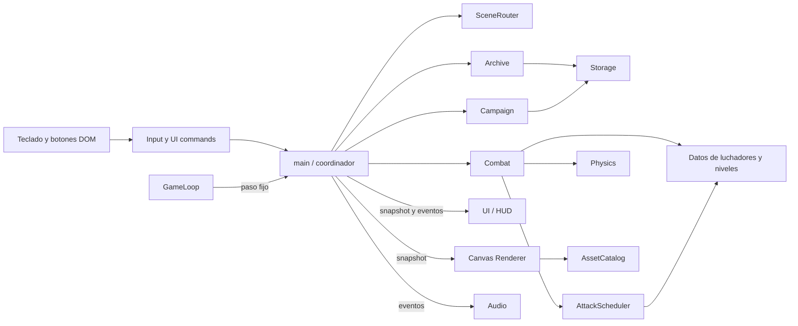

# Fase 1.6 — arquitectura, glosario y contratos

**Estado:** propuesta documental para la futura primera versión 2D; no hay módulos implementados. Consolida [combate y datos](FASE_1_2_COMBATE_Y_DATOS.md), [arenas](FASE_1_3_FICHAS_ARENAS.md), [pantallas](FASE_1_4_PANTALLAS_Y_ESCENAS.md) y [Visor](FASE_1_5_ARCHIVO_Y_VISOR.md). Se favorecen módulos ES de JavaScript, Canvas 2D y DOM semántico, sin dependencia externa inicial. Los nombres/rutas son contratos propuestos, no archivos existentes.

## Lenguaje común y fuente única

| Término | Significado y dueño |
|---|---|
| `screen` | Uno de diez estados principales; lo valida `scene-router`. Una confirmación y el reintento son variantes internas. |
| `levelIndex` / `attemptsRemaining` / `marks` | Progreso de campaña, propiedad de `campaign`; no se duplican en `levels` ni UI. |
| `patternId` / `attackInstanceId` | Tipo configurable de ataque / ejecución única con contactos propios, propiedad del planificador y combate. |
| `warningSec` / `remainingSec` | Duración configurable del aviso / tiempo restante real del duelo, ambos en segundos del reloj simulado. |
| `bodyBox` / `hurtBox` / `attackBox` | Separación y límites / recepción de daño / volumen ofensivo activo. Las dimensiones son datos, nunca se infieren del PNG. |
| `safeGeometry` | Geometría fijada al inicio de `WARNING` por planificador; UI y Visor leen la misma. |
| `visorUnlocked` / `visorState` | Hallazgo persistente del Archivo / carga efímera por combate. |
| `snapshot` / `domainEvent` / `command` | Estado de sólo lectura / hecho único con ID y paso / petición semántica validable. |

La tabla de [1.2](FASE_1_2_COMBATE_Y_DATOS.md) posee vida, daño y puntuación iniciales; [ARENAS_Y_COMBATE.md](ARENAS_Y_COMBATE.md) y [1.3](FASE_1_3_FICHAS_ARENAS.md) detallan patrones/cajas. Al implementar, se trasvasarán a **una sola configuración** por dato. El HUD y el Visor no conservarán copias numéricas. El texto visible permanece en español; nombres técnicos expresan dominio y unidad (`Px`, `Sec`) y evitan abreviaturas vagas.

## Mapa de módulos propuesto

| Archivo futuro | Responsabilidad única | Contrato público conceptual |
|---|---|---|
| `src/main.js` | Componer dependencias, traducir comandos, entregar eventos y aplicar transiciones. | `startApp()`, `dispatch(command)`; no calcula daño ni dibuja. |
| `src/game-loop.js` | Único `requestAnimationFrame`, timestamp/acumulador y paso fijo de `1/60 s`. | `start`, `pause(reason)`, `resume`, `stop`, `dispose`; callbacks `updateFixed(dtSec)` y `render(alpha)`. |
| `src/scene-router.js` | Validar los diez estados y confirmación activa; transición y ciclo `enter/exit`. | `requestTransition(next,payload) → accepted/reason`; `getScreenView()`. |
| `src/input.js` | Traducir teclado a acciones por paso, buffer y limpieza. | `snapshotForStep()`, `clear()`, `dispose()`; no conoce daño/cola. |
| `src/campaign.js` | Elección, nivel, marcas, intentos, puntuación y final. | `start(fighterId)`, `acceptFightResult(result)`, `confirmRestart/Abandon`, `getView()`. |
| `src/combat.js` | Orquestar encuentro, reloj, luchadores, daño, enfriamientos, Visor y resultado único. | `createFight(config,unlocked)`, `update(dtSec,actions) → {snapshot,events,terminal?}`. |
| `src/attack-scheduler.js` | Secuencia y fase de ataques del jefe, `attackInstanceId` y geometría de aviso. | `advance`, `peekNextAttack()` de sólo lectura, `getCurrentAttack()`; la fase NULL reinicia secuencia tras recuperación. |
| `src/physics.js` | Integrar movimiento y suelo, limitar/separar cuerpos y entregar contactos candidatos. | `step(motion,shapes,dtSec) → {motionResults,contactCandidates}`; no toca HP. |
| `src/fighter-data.js` / `src/level-data.js` | Configuración de personajes, patrones y cuatro arenas; sin progresión ni efectos. | Consulta por ID con unidades y validación de esquema. |
| `src/archive.js` | Cuatro fichas, normalización GUÍA/GUIA y desbloqueo. | `consultMaintenanceWord(raw) → {status,unlocked,persistError?}`. |
| `src/storage.js` | Adaptar `localStorage` para récord, preferencias y hallazgo; sin campaña activa. | `read(key)`, `write(key,value) → ok/error`; fallo aislado. |
| `src/ui.js` | Menús, tarjetas, HUD, diálogos, avisos accesibles y foco. | `show(view,events)`, `dispose()`; emite comandos, no muta dominio. |
| `src/renderer.js` | Dibujar snapshot en Canvas 2D, capas y escalado. | `resize(cssSize,dpr)`, `render(snapshot,alpha)`; sin actualización de juego. |
| `src/audio.js` | Reproducir eventos después de interacción y preferencias. | `consume(events)`, `setPreferences`; fallo no altera combate. |
| `src/assets.js` | Manifiesto, carga, estado y permiso declarados de recursos. | `load(requiredIds) → {ready,missing}`; rutas fuera de reglas. |

`index.html` será estructura semántica con Canvas y regiones de UI; `styles.css` sólo presentación, foco y ajuste. La arquitectura general de [DOCUMENTACION.md](DOCUMENTACION.md) queda especializada por este mapa: `levels` es sólo datos y `campaign` posee progresión. No se crea ECS, cámara de seguimiento, mapa de baldosas, Matter.js o pooling fijo sólo porque aparezcan en perfiles genéricos.

Las flechas de vuelta desde UI, Renderer o Audio hacia Campaña/Combate no existen. `main` compone referencias mediante inyección explícita. `GameLoop` recibe callbacks y no importa `Combat`. Archivo y Campaña acceden a almacenamiento mediante adaptador; un error de escritura retorna resultado, no una excepción silenciosa que rompa el duelo.

## Orden de paso y fronteras

1. `Input` conserva `pressed` hasta que haya paso fijo; `snapshotForStep()` entrega `{moveX,guardHeld,jumpPressed,normalAttackPressed,specialTap,visorPressed,pausePressed}` y consume pulsos una vez. E del teclado y botón HUD llegan al mismo comando `requestVisor`, colapsado por paso. Escape tiene prioridad: `main` transita a `PAUSE`, limpia entrada y no llama `Combat.update` ese paso.
2. En `FIGHT`, `Combat.update(1/60, actions)` procesa el Visor sobre el aviso al inicio del paso, integra movimiento por `Physics`, avanza ataque/proyectiles, resuelve contactos, daño y término según [1.2](FASE_1_2_COMBATE_Y_DATOS.md). Física devuelve **candidatos**, no aplica vida ni puntos. `Combat` marca objetivo contactado por instancia aun si invulnerable; sólo daño positivo inicia 0,45 s de invulnerabilidad del estudiante.
3. Un contacto usa `hurtBox`, nunca `bodyBox` (que sólo separa cuerpos). `floorSensor` deja de alcanzar cuando los pies salen del suelo; `lowProjectile` y `lineRun` requieren menos de 30 px de despeje para acertar; `fullFloorSweep` de NULL alcanza fuera de la franja SEGURA incluso si el jugador salta. La configuración de cada patrón declara una categoría. Para carrera/proyectil rápido, Física revisa trayecto entre pasos para evitar atravesar una caja sin registrar contacto. Sólo Combate aplica defensa y `max(1,ceil(base×factor))`.
4. `Combat` emite `FightResult` terminal una sola vez, con ID de encuentro, nivel, victoria/derrota, vida y segundos capturados. `Campaign.acceptFightResult` lo consume una vez y devuelve progreso/transición semántica. Si hay terminal, `main` corta pasos fijos restantes de ese fotograma, limpia acumulador y acciones del encuentro, y cambia pantalla fuera de `render`. El récord se compara sólo en Game Over o Victoria.
5. `main` publica `ScreenView`, `HudView`, `ArchiveView`, `SettingsView` y un snapshot de arena de **sólo lectura**. UI, Renderer y Audio reciben los mismos eventos/IDs; no recalculan daño, puntos ni predicción. `Renderer.render` no llama `update`. UI anuncia cambios importantes una vez, no cada frame.

`DomainEvent = {eventId,fightId?,step?,kind,payload}`. `eventId` permite a consumidores evitar reproducción/aviso duplicado; no sustituye la idempotencia de Campaña. Eventos mínimos: `warningStarted`, `attackCancelled`, `contactIgnored`, `damageApplied`, `visorRevealed`, `fightFinished`, `screenChanged`, `storageFailed`. `ContactCandidate` incluye `attackInstanceId`, `patternId`, objetivo y sub-ID de proyectil si existe. No se publican objetos mutables internos.

## Comandos y errores de borde

| Entrada | Valida/ejecuta | Respuesta observable |
|---|---|---|
| Inicio, selección, avance de escena, pausa, siguiente nivel | `scene-router` y `campaign` según estado | Transición aceptada con nuevo `ScreenView`, o rechazo con causa sin alterar foco/partida. |
| Reiniciar/abandonar | UI abre confirmación; `main` sólo envía al dueño al confirmar | Campaña consume intento o descarta campaña una vez; Cancelar no cambia progreso. |
| Consultar palabra | `archive` + `storage` | Estado vacío/incorrecto/nuevo/repetido, incluido fallo de persistencia visible. |
| Activar Visor | `combat` | Nuevo estado/lectura de ataque o rechazo sin efecto; UI no toca carga. |
| Cambiar sonido/reducir movimiento | Preferencias en `storage`, aplicadas a UI/Audio/Renderer | Si escritura falla, preferencia opera en sesión y muestra aviso discreto. |

Falta de Canvas 2D o de configuración obligatoria de patrón/zona impide **iniciar** el combate y muestra un error recuperable; no se improvisa un ataque invisible. Un recurso visual ausente usa marcador explícito durante la fase 2 sólo si conserva telegráficos y cajas; se informa. Audio ausente o bloqueado permite jugar con señales visuales. Al salir de pantalla se retiran sus listeners; los listeners de teclado globales se instalan una vez al montar y se eliminan al desmontar.

`requestAnimationFrame` entrega tiempo de pared en ms; el bucle lo convierte a segundos simulados con paso fijo. Tope inicial de cinco pasos por fotograma; tiempo excedente se descarta con diagnóstico en vez de acelerar avisos tras una pausa. `blur`, pestaña oculta o retrato durante FIGHT pausan y limpian buffer/teclas; reanudar explícitamente resetea timestamp/acumulador. No hay avance de vida, reloj, enfriamiento, Visor o ataque durante pausa. Canvas lógico 960×540, `fit` centrado sin recorte, suavizado desactivado y DPR efectivo ≤2; fondos finales pixel art. El estado simulado fija geometría de telegráficos, y la interpolación visual no la mueve fuera del volumen de daño. A escala fraccionaria se revisará visualmente el grosor de píxeles cuando exista arte.

## Casos de integración previstos, sin ejecutar

| ID | Escenario | Contrato a comprobar |
|---|---|---|
| INT-01 | Frame lento termina duelo. | Un `fightFinished`, una marca/bono, ningún paso posterior del duelo saliente. |
| INT-02 | Esc junto con ataque/Visor y pestaña oculta. | Pausa antes de simular; cero daño, carga o tiempo consumidos. |
| INT-03 | Balón de ida y vuelta o tres notas de Nadia. | Contactos únicos por instancia/sub-ID; física no aplica vida. |
| INT-04 | Tercera derrota o reinicio con último intento. | Una resta de intento y Game Over; UI no suma/resta. |
| INT-05 | Visor pendiente y cambio de fase NULL. | Cola leída sin consumo y aviso/geometría reales en UI/Canvas. |
| INT-06 | Archivo, recarga y fallo de almacenamiento. | Desbloqueo aislado, mensaje honesto, campaña no bloqueada. |
| INT-07 | Shift+Tab, Tab al botón del Visor, campo GUÍA. | Navegación sin habilidad accidental; entrada de texto normal; foco restaurado. |
| INT-08 | Audio/recurso visual faltante y cambio repetido de pantalla. | Aviso/fallback según recurso, sin listeners duplicados ni regla jugable alterada. |

**Puerta 1.6:** mapa sin ciclos, dueño único de cada regla, entradas/salidas y degradación definidos; `levels` no administra progresión y UI/render/audio no mutan dominio. Los casos INT son criterios para fases de construcción y revisión, no pruebas realizadas.
